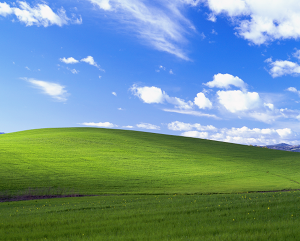

# Bliss

*This is an ekphrastic poem written in response to the photograph with the same name by Charles O'Rear, shown below.*  
  
(*Bliss* Copyright © 1998 Charles O'Rear. This image is being shown for illustration purposes only.)

When I turn on the computer  
I see the wonders of nature.  
I’m greeted with the green hill  
Along with the blue sky  
With white clouds scattered  
All around the landscape.

It’s the telltale sign  
Of the glorious system  
That is Windows XP.  
It’s a blissful scene  
That will stick within me  
For years to come.
