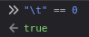

# Project Rhythm Song

Project Rhythm Song (PRS) is the primary chart format for Project Rhythm. All charts in the game are expected to be in this format.

# Specification

The PRS format is a columnar format. Columns are separated a **single space**. Tabs are not supported, because it would make 0 a delimiter as well, which we obviously don't want. (see image below for why)  


As for the columns themselves, the first column denotes the timestamp (in milliseconds) at which the note or event will occur. Integers are preferred, though floating point values are supported. Since PRSv1.2, comments have been officially supported. The parser shall ignore any line where the first column has a value that's not a number. This includes blank lines.

The second column is treated differently depending on its value. Any integer value is treated as a note. In that case, the third column is the length of the note, in hundredths of a second. Any other type of value is treated as an event. Any column after the event is treated as an argument.

## Notes

Note objects are exactly 4 digits long, each of which is either a 0 or a 1. This creates a 4-bit fret mask, read from left to right. The left-most bit is a green note, then red, then yellow, then blue.

```
1000 1010 2
```

The above example creates a green-yellow chord with length 2 at timestamp `1000`. To create a 4-note chord, the fret mask would be `1111`. Avoid creating notes with a fret mask of `0000`; it will result in undefined behavior. Also avoid creating notes with a fret mask with any digit other than 0 or 1. Decimal representations of fret masks are not supported.  
Right: `12375 1001 0`  
Wrong: `12375 9 0`

## Events

Event names can be any string, except for ones that consist entirely of digits. However, it is recommended to only use letters and underscores (\_).  
Example event usage: `10000 guitar_solo` or `12500 lyric These are lyrics!`

### Officially supported events

#### `bass_solo`

To be implemented in a future release of Project Rhythm.

#### `bre duration`

Short for Big Rock Ending. `duration` is the length of the BRE in milliseconds. Only use this when appropriate. Use this near the end of the song to allow players to mash their keyboard and earn bonus points if they hit all remaining notes afterwards. All note objects placed during a BRE shall be ignored.

#### `drum_solo`

To be implemented in a future release of Project Rhythm.

#### `guitar_solo`

To be implemented in a future release of Project Rhythm.

#### `lyric lyrics`

New in PRSv1.4

Display `lyrics` on the screen.  
Recommended usage: One line per event.  
When called with no arguments, clear the displayed lyrics.

#### `solo_end`

To be implemented in a future release of Project Rhythm.

### Special events

These are events which cannot be instantiated like other events can in PRSEdit, where each one of these events has its own hotkey. These events are either song metadata, or song synchronization.

#### `ARTIST a`

New in PRSv1.3.

Set the song artist to `a`, where `a` can be any string. This event must be at position 0.

#### `bpm n`

New in PRSv1.1.

Set the tempo to `n` beats per minute. `n` can be any floating point value greater than 0, except for Infinity.

#### `NAME n`

New in PRSv1.3.

Set the song name to `n`, where `n` can be any string. This event must be at position 0.

#### `ts num den`

New in PRSv1.1.

Set the time signature to `num`/2<sup>`den`</sup>. `num` is the numerator, and can be any integer greater than 0. `den` is log<sub>2</sub> of the denominator, and can be any integer greater than or equal to 0.  
Example: `ts 4 2` sets the time signature to 4/4.

# Changelog

## PRSv1.4

- New event: `lyric`
- First supported in: Project Rhythm v0.6.73
    - Since this is not a special event, separate support did not need to be added for PRSEdit.

## PRSv1.3

- New special events: `ARTIST` and `NAME`
- First supported in: Project Rhythm v0.5.59 and PRSEdit v1.1.39

## PRSv1.2

- Added comments
- First supported in: Project Rhythm v0.4.51 and PRSEdit v1.1.39.2

## PRSv1.1

- New special events: `bpm` and `ts`
- First supported in: Project Rhythm v0.3.35 and PRSEdit v0.1.19

## PRSv1.0.1

- Changed delimiter to space

## PRSv1.0

Initial specification
